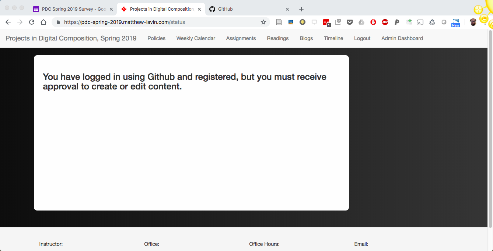

# Instructions to Set Up Blogs and Custom Blog Names

1. Go to https://pdc-spring-2019.matthew-lavin.com
2. Click the menu link titled "Login"
3a. Verify that a new link titled "Admin" now appears in the menu. 
3b. If the link does not appear and you are brought to a screen that says "you must receive approval to create or edit content," inform me in class. 

This warning message means I have not yet approved your Github username, which could be a mistake on my end or an issue with the Github username you provided when you filled out the Background and Interests Survey. If you have not completed the Background and Interests Survey, do so immediately.    

4. Click the link titled "Admin" and, under the student content submenu, click the link titled "User Profile"
5. Your Github username should appear in gray. Add a display name such as "Matt L." or "Matt Lavin" and a custom blog title that describes you in some way. For example, my blog title is "A Professor's Ruminations." Your blog title will appear on https://pdc-spring-2019.matthew-lavin.com/blogs. The web address of your blog will be your blog title with spaces convrted to hyphens, so please avoid special characters like @,#,$ etc. 
6. When you have completed these steps, click the blue "Save" button
7. Navigate to https://pdc-spring-2019.matthew-lavin.com/blogs and verify that your blog title is listed. Click on your blog title to verify that the link bring you to a page for your blog. 

